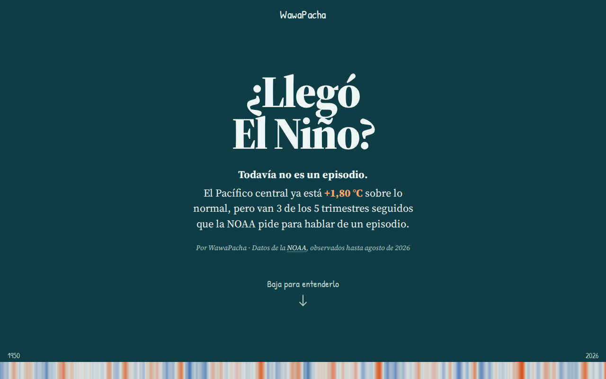

# WawaPacha



WawaPacha is a public web observatory for the signals of El Niño in Peru. It is
a static site ([Nuxt 4](https://nuxt.com/) with Bun) fed by a Python data
pipeline (uv), with no backend and no accounts. Live at
<https://aiplaygrounds-org.github.io/wawapacha/>.

## Run it

You need [Git](https://git-scm.com/) and
[mise](https://mise.jdx.dev/getting-started). mise installs the Bun and uv
versions pinned in [`mise.toml`](mise.toml).

```sh
mise install
cd web
mise exec -- bun install
mise exec -- bun run dev
```

Open <http://localhost:3100>. If mise is activated in your shell, drop
`mise exec --`.

To download a dataset and publish it to `data/`, run this from `pipeline/`:

```sh
uv run wawapacha-pipeline run noaa-cpc-oni
```

```text
Published noaa-cpc-oni: 919 records in data/noaa-cpc-oni.json
```

If the download fails validation, nothing is published and the previous JSON
stays.

## What the site shows today

The `/` page uses NOAA's [ONI](docs/sources.md#noaa-cpc-oni) since 1950. It
answers “¿Llegó El Niño?”, explains what the central-Pacific signal means for
Peru, shows the history as an interactive ECharts chart and a recent-data table,
and describes the method. The page also links to ENFEN's official communiqués
and SENAMHI's meteorological notices. The ONI page shows its source, data type,
period and last ingestion time from the published JSON.

## What is where

| Folder                         | Holds                                                                 |
| ------------------------------ | --------------------------------------------------------------------- |
| [`web/`](web/)                 | The web app.                                                          |
| [`pipeline/`](pipeline/)       | Downloads, validates and publishes the data.                          |
| [`data/`](data/)               | The published JSON.                                                   |
| [`notebooks/`](notebooks/)     | [marimo](https://marimo.io) notebooks that walk through the pipeline. |
| [`sources.toml`](sources.toml) | The source registry.                                                  |
| [`schema/`](schema/)           | The contract of the published JSON.                                   |
| [`docs/`](docs/README.md)      | Chart rules, data contract, concepts, source workflow and catalog.    |

## Not in the product

The site has no accounts, no notifications, no public API, no downloads of its
own, no models of its own and no model consensus.

## More

[`ARCHITECTURE.md`](ARCHITECTURE.md) maps the code.
[`CONTRIBUTING.md`](CONTRIBUTING.md) covers branches, checks and merges.
[`docs/add-a-source.md`](docs/add-a-source.md) adds a source.
[`ROADMAP.md`](ROADMAP.md) lists what is not built.
